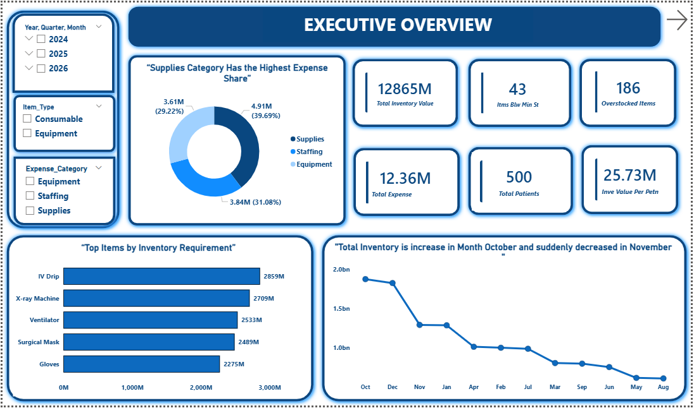
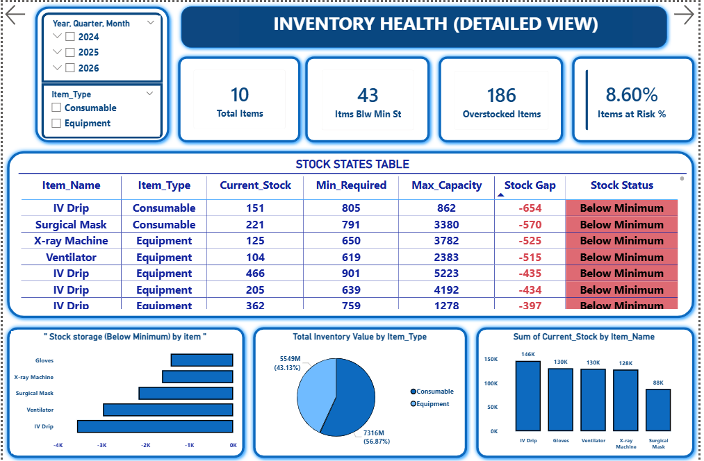
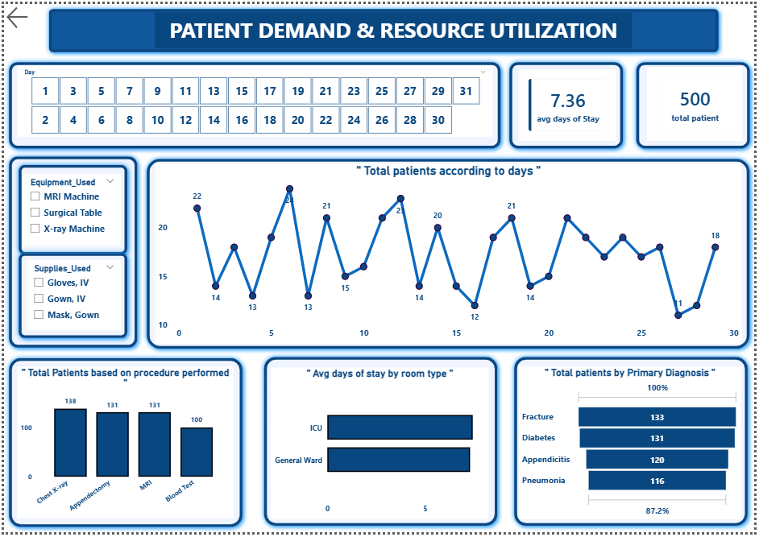
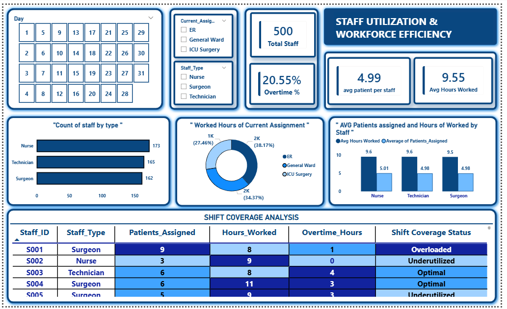

# Hospital Supply Chain Analytics Project

## 1] Project Overview

This project analyzes hospital supply chain and operations data using Excel, SQL, and Power BI.
The goal is to improve inventory management, financial tracking, patient flow analysis, and staff utilization to support data-driven operational decisions in a healthcare environment.

## 2] Tools & Technologies

Excel – Data storage and initial exploration

SQL (MySQL) – Data normalization and analysis

Power BI – Interactive dashboards and visual storytelling

## 3] Dataset Description

The dataset is stored in an Excel workbook with multiple sheets, later normalized into separate tables for SQL analysis.

### a] Financial Data

Columns: Date, Amount, Expense_Category, Description

Rows: 500 | Columns: 4

**[View Financial Data](Datasets/finantial.csv)**

### b] Inventory Data

Columns: Date, Item_ID, Item_Type, Item_Name, Current_Stock, Minimum_Required, Max_Capacity, Unit_Cost, Avg_Usage_Per_Day, Restock_Lead_Time, Vendor_ID

Rows: 500 | Columns: 9

**[View Inventory Data](Datasets/inventory.csv)**

### c] Patient Data

Columns: Patient_ID, Admission_Date, Discharge_Date, Primary_Diagnosis, Procedures_Performed, Room_Type, Bed_Days, Supplies_Used, Equipment_Used, Staff_Needed

Rows: 500 | Columns: 10

**[View Patient Data](Datasets/patient.csv)**

## d] Staff Data

Columns: Staff_ID, Staff_Type, Shift_Date, Shift_Start_Time, Shift_End_Time, Current_Assignment, Hours_Worked, Overtime_Hours, Patients_Assigned

Rows: 500 | Columns: 9

**[View Staff Data](Datasets/Staff.csv)**

## e] Vendor Data

Columns: Vendor_ID, Vendor_Name, Item_Supplied, Avg_Lead_Time, Cost_Per_Item, Last_Order_Date, Next_Delivery_Date

Rows: 3 | Columns: 7

**[View Vendor Data](Datasets/vendor.csv)**

## 3] SQL Data Preparation

- Since MySQL does not support multi-sheet Excel files, each sheet was:

- Exported as a CSV

- Imported into MySQL as separate normalized tables

- Used for analytical queries and KPI generation

### **SQL Analysis Performed**

- Top 5 high-cost inventory items

- Expense breakdown by category

- Top 5 critical items by stock gap

- Average bed days by room type

- Average working hours by staff type

**[View SQL Queries](supply_chain.sql)**

## 4] Power BI Dashboards
### 🔹 Page 1 – Overview

#### Provides a high-level view of:

- Inventory value

- Monthly spending trends

- Patient-driven demand indicators

- Overall supply chain health

📌 Designed for executive-level decision-making

****

### 🔹 Page 2 – Inventory Health

#### Focuses on:

- Stock gaps

- Minimum threshold violations

- Overstocking risks

- Replenishment priorities

📌 Supports proactive inventory planning

****

### 🔹 Page 3 – Patient Analysis

#### Analyzes:

- Patient volume by diagnosis

- Length of stay

- Resource consumption

- Impact on inventory and staffing

📌 Links patient demand to operational resources

****

### 🔹 Page 4 – Staff Utilization

#### Evaluates:

- Shift coverage

- Patient load per staff

- Overtime patterns

- Workforce efficiency

📌 Identifies burnout risks and staffing inefficiencies

****

## 5] Key Insights

- Technicians show high overtime (21.38%), indicating staff overload

- Multiple critical inventory shortages identified

- Patient load varies significantly by staff type and shift

- Improved staff allocation can reduce overtime costs

## 6] Business Recommendations

- Implement demand forecasting for inventory replenishment

- Optimize staff shift scheduling to balance workload

- Monitor KPIs regularly using Power BI dashboards

- Reduce operational costs by minimizing overtime

## Author

**Ashish Jadhav** 
Aspiring Data Analyst 
Skills: Excel | Python | SQL | Power BI | Statistics | Data Visualization